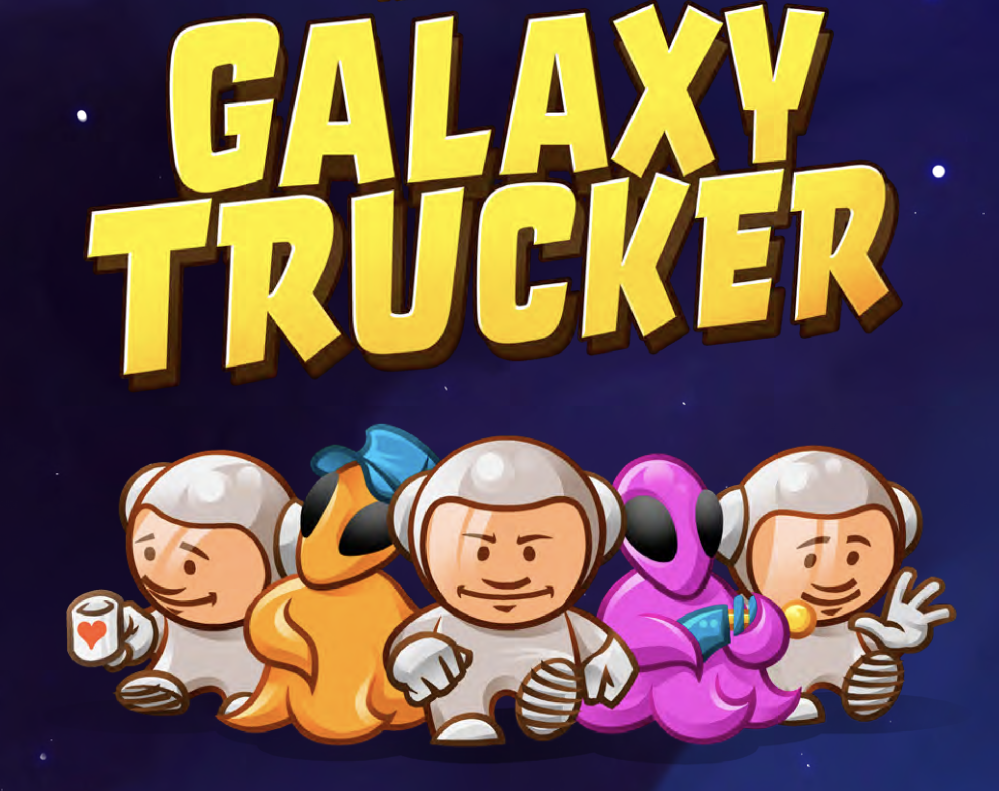
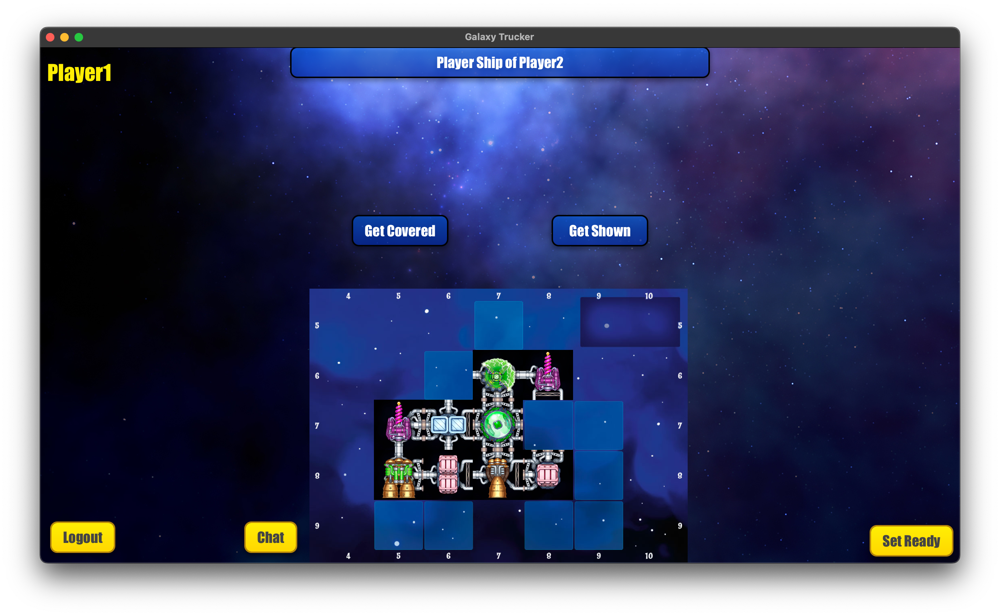
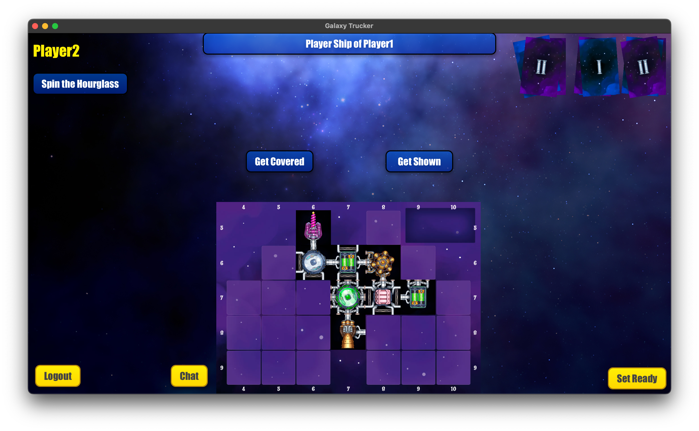

# Galaxy Trucker - Software Engineering Project, A.Y. 2024/2025

<h2 style="font-size: 24px; font-weight: normal;">Grade 30L/30/h2>

## Team
- [Matteo Vignocchi](https://github.com/matteovignocchi)
- [Francesco Lo Conte](https://github.com/24GIOCONDO24)
- [Oleg Nedina](https://github.com/Oleg-Nedina)
- [Antonio Gabriele La Vecchia](https://github.com/gabrielelv)

## Overview
This software project brings the board game *Galaxy Trucker* into a distributed digital environment. Players can interact via graphical or textual interfaces, building their ships and facing space hazards according to the [original rules](src/main/resources/rules/galaxy-trucker-rules-it.pdf).


## Features

| Feature                      | Implemented |
|------------------------------|----|
| Complete Rules               | ✅ |
| TUI                          | ✅ |
| GUI                          | ✅ |
| RMI                          | ✅ |
| Socket                       | ✅ |
| Demo flight mode             | ✅ |
| Multiple concurrent matches  | ✅ |
| Persistent Game Recovery     | ✅  |
| Resilience to Disconnections | ✅  |   

## Launching the Game

### Server

To launch the server, follow these steps:

1. Open a terminal window.
2. Navigate to the folder where the server JAR file is located. For example:
   ```bash
   cd /path/to/server/jar/
3. Run the following command:
   ```bash
   java -jar PSP5-server.jar

### Client

To launch the client, follow these steps:

1. Open a terminal window.
2. Navigate to the folder where the client JAR file is located. For example:
   ```bash
    cd /path/to/client/jar/
3. Run the following command:
   ```bash
   java -jar PSP5-client.jar
At startup, you will be prompted to choose between:

- GUI (JavaFX) or TUI (text-based interface)

- Communication protocol: RMI or Socket

> ⚠️ **If the GUI does not start correctly**, it may be due to a missing JavaFX runtime.  
> In that case, run the client using the following command, replacing `/path/to/javafx-sdk/lib` with the actual path to your JavaFX installation:
   ```bash
      java \ --module-path /path/to/javafx-sdk/lib \ --add-modules javafx.controls,javafx.fxml \-jar PSP5-client.jar  
   ```
## Game Screenshots

### Ship Assembly Phase in Demo


### Ship Assembly Phase


### Flight Phase


## Test Coverage

| Module     | Coverage |
|------------|----------|
| Model      | 97%      |
| Controller | 83%      |

## Development Tools

- [IntelliJ IDEA](https://www.jetbrains.com/idea) – Primary IDE for development
- [draw.io](https://www.drawio.com) – Used for creating class and sequence diagrams
- [JavaFX](https://openjfx.io) – Framework for building the graphical user interface
- [SceneBuilder](https://gluonhq.com/products/scene-builder) – Tool for designing JavaFX interfaces visually
- [Maven](https://maven.apache.org) – Build automation and dependency management tool
- [JUnit](https://junit.org) – Framework for writing and executing unit tests
  
## License

[**GalaxyTrucker**](https://www.craniocreations.it/prodotto/galaxy-trucker) is property of [_Cranio Creations_] and all of the copyrighted graphical assets used in this project were supplied by [**Politecnico di Milano**] in collaboration with their rights' holders.

Distribution, copying or reproduction of these contents and images out of this project is forbidden, as well as publishing these contents for other purposes.
Commercial use of the aforementioned content is as well forbidden.

[_Cranio Creations_]: https://www.craniocreations.it/
[**Politecnico di Milano**]: https://www.polimi.it/
